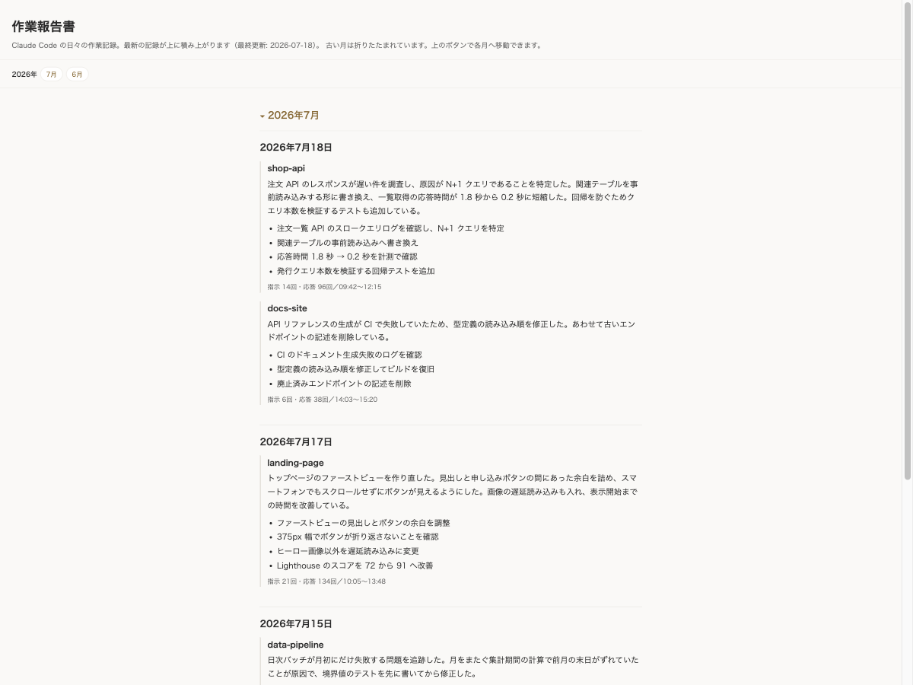

# kiroku — Claude Code 作業報告書の自動生成（macOS）

> 昨日何をやったか、思い出せますか？
> kiroku は Claude Code での作業を Claude 自身に要約させ、
> 1 枚の HTML に日ごとに積み上げます。日報も週報も、ここから書けます。



- 全プロジェクト横断で「昨日までの作業」をまとめる
- 同じ日に何度実行しても、その日の作業は 1 項目にまとめ直される
- スリープ復帰時に自動実行（任意）、または Dock のアイコンをクリックで実行
- 生成物・元データはすべてローカル。外部送信なし

## 動作要件

- **macOS**（`osacompile` / `open` / 任意で Homebrew の sleepwatcher を使用）
- **Python 3**（標準ライブラリのみ。追加パッケージ不要）
- **Claude Code CLI**（`claude` コマンド。要約に使用）

## インストール

```bash
git clone https://github.com/munetomoando/kiroku.git
cd kiroku
./install.sh
```

`install.sh` は次を行います:

1. macOS / `python3` / `claude` CLI の確認
2. クリックで起動できるランチャーアプリ `/Applications/kiroku.app` を生成
   （配置パスを埋め込み、同梱アイコンを適用）
3. （任意）スリープ復帰時の自動実行を sleepwatcher で設定

生成後、Finder で `kiroku.app` を Dock へドラッグしておくと、いつでも 1 クリックで
報告書を開けます。

## 使い方

- **アイコンをクリック**: 新しい作業があれば報告書を更新し、更新の有無に関わらず
  必ずブラウザで報告書を開きます（「今の報告書を見る」操作）。要約には時間がかかる
  ことがあるため、実行中はブラウザに**円形リングの進捗画面**を表示し、現在の段階
  （作業を収集中／要約を生成中（N日中 i日目）／報告書を作成中）とともにリングが
  埋まっていきます。完了すると同じタブがそのまま報告書に切り替わります。
  この進捗表示は `progress_server.py` が **127.0.0.1 限定**で一時的に立てる極小
  サーバで描画します（外部通信なし・処理が終わると自動終了）。
- **手動実行（ターミナル）**:

      bash run-kiroku.sh

- **自動（スリープ復帰）**: 前日までに新しい作業があった時だけ報告書を更新・表示します。

初回は `state.json` が無いため、過去 2 日分を日ごとにバックフィルします。

## 仕組み

`run-kiroku.sh` が 3 段階で動きます:

1. `gather.py` … `~/.claude/projects` の各セッション jsonl から、前回記録以降の作業を
   日付 × プロジェクト別に抽出。前回以降に新しい作業が無ければ何もしません。
   （要約用の内部呼び出しは専用ディレクトリ `.summarizer` に隔離し、記録対象から除外）
2. `claude -p` … 抽出結果を要約し、プロジェクトごとの要約文＋箇条書きを生成。
3. `render.py` … `entries.json`（全記録の元データ）に当日分を追記し、そこから
   `作業報告書.html` を毎回まるごと再生成。

`entries.json` が真実の源で、HTML は毎回そこから再生成されます。要約に失敗しても、
機械抽出した箇条書きで最低限の記録を残します。

## sleepwatcher を後から設定する

`install.sh` でスキップした場合は、次で有効化できます:

```bash
brew install sleepwatcher
ln -sf "$PWD/wakeup.sh" ~/.wakeup
brew services start sleepwatcher
```

`wakeup.sh` は復帰後 20 秒待ってから `run-kiroku.sh` を起動します。

## ランチャーアプリを作り直す

`install.sh` を再実行すれば再生成されます。手動で作る場合:

```bash
sed "s#__KIROKU_DIR__#$PWD#g" launcher.applescript > /tmp/kiroku.applescript
osacompile -o /Applications/kiroku.app /tmp/kiroku.applescript
cp icon/kiroku.icns /Applications/kiroku.app/Contents/Resources/applet.icns
codesign --force --deep -s - /Applications/kiroku.app
```

アプリ内スクリプトだけ差し替えたい場合（アイコンを保持）は、`Contents/Resources/Scripts/main.scpt`
を上書きして再署名してください。

## ファイル構成

| ファイル | 役割 |
|---|---|
| `作業報告書.html` | 成果物（累積・単一ファイル。git 管理外） |
| `entries.json` | 全記録の元データ（真実の源。git 管理外） |
| `state.json` | 前回記録タイムスタンプ・最終記録日（git 管理外） |
| `config.py` | パス・定数・時刻ユーティリティ |
| `gather.py` | jsonl 抽出（決定的） |
| `prompt.py` | 要約プロンプト生成・応答パース・フォールバック |
| `render.py` | entries.json 追記＋HTML 再生成（決定的） |
| `run-kiroku.sh` | オーケストレーション（ロック・ログ付き） |
| `progress_server.py` | 実行中の円形リング進捗画面（127.0.0.1 限定の一時サーバ） |
| `wakeup.sh` | sleepwatcher 用ラッパ |
| `launcher.applescript` | ランチャーアプリの雛形（install.sh がパスを埋め込む） |
| `install.sh` | セットアップ（アプリ生成・sleepwatcher 設定） |

`entries.json` / `state.json` / `作業報告書.html` / `kiroku.log` / `.summarizer/` は
`.gitignore` 済みで、各利用者のローカルにのみ生成されます。

## リセット（最初から作り直す）

```bash
rm -f state.json entries.json 作業報告書.html
bash run-kiroku.sh   # 再び過去 2 日をバックフィル
```

## アンインストール

```bash
brew services stop sleepwatcher   # 自動実行を設定した場合
rm -f ~/.wakeup
rm -rf /Applications/kiroku.app
```

あとは clone したディレクトリを削除すれば完了です。

## トラブルシュート

- 生成されない: `tail -n 30 kiroku.log` を確認。
- 要約が空: `claude -p` が単体で動くか（認証）を確認。失敗時も箇条書きで記録は残ります。
- アイコンが Dock に反映されない: 一度 Dock から外して入れ直すと確実です。

## 開発

テストと（アイコン再生成用の）依存は仮想環境で:

```bash
python3 -m venv .venv
.venv/bin/pip install pytest pillow
.venv/bin/python -m pytest -q
```

（実行時は標準ライブラリのみで動くため、利用だけなら venv は不要です。）

## メンテナ向け: OGP 画像の更新

X や Facebook でシェアされた際のカード画像（GitHub の Social preview）は
REST API / `gh` CLI からは設定できず、画面からの手動アップロードが必要です。

1. リポジトリ → Settings → General → Social preview
2. `docs/images/ogp.png` をアップロード

画像を撮り直す場合は次を実行してから、上の手順で差し替えます:

    python3 docs/demo/seed_demo.py /tmp/kiroku-demo.html

キャプチャ設定は次のとおりです:

- `docs/images/hero.png` — ビューポート 900×1390、ズームなし
- `docs/images/ogp.png` — ビューポート 1280×640、ズーム 1.4（サムネイルでも読めるように拡大）
- ブラウザによっては `file://` を開けないため、`python3 -m http.server` で 127.0.0.1 に配信してから開く

## メンテナ向け: トラフィック記録（任意）

GitHub の Traffic API は直近 14 日分しか返さないため、長期のクローン数・閲覧数・
スター推移を残すには毎日のスナップショットが必要です。`.github/workflows/traffic.yml`
がそれを行い、結果を専用ブランチ `traffic-data` の CSV に累積します（`main` は汚しません）。

有効化の手順（リポジトリ所有者のみ）:

1. **PAT を作成**: GitHub → Settings → Developer settings →
   Fine-grained personal access tokens →「Generate new token」。
   - Repository access: このリポジトリ（`kiroku`）のみ
   - Permissions: **Contents = Read and write**、**Administration = Read-only**
     （Administration:Read が Traffic API に必要）
2. **Secret を登録**: リポジトリ → Settings → Secrets and variables → Actions →
   「New repository secret」。Name = `TRAFFIC_TOKEN`、Value = 上記トークン。
3. あとは毎日 03:17 UTC に自動実行されます。すぐ試すには Actions タブから
   「Traffic snapshot」→「Run workflow」で手動実行できます。

記録は `traffic-data` ブランチの `clones.csv` / `views.csv` / `stars.csv` に貯まります。
（設定しなくても kiroku 本体の動作には一切影響しません。）

## ライセンス

MIT License（[LICENSE](LICENSE) を参照）。
